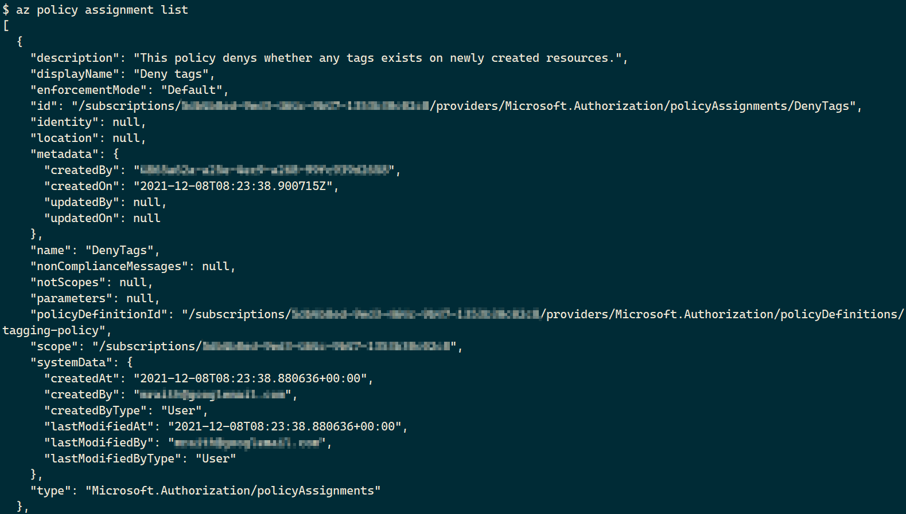

# Azure Infrastructure Operations Project: Deploying a scalable IaaS web server in Azure

### Introduction
For this project, you will write a Packer template and a Terraform template to deploy a customizable, scalable web server in Azure.

### Getting Started
1. Clone this repository

2. Create your infrastructure as code

3. Update this README to reflect how someone would use your code.

### Dependencies
1. Create an [Azure Account](https://portal.azure.com) 
2. Install the [Azure command line interface](https://docs.microsoft.com/en-us/cli/azure/install-azure-cli?view=azure-cli-latest)
3. Install [Packer](https://www.packer.io/downloads)
4. Install [Terraform](https://www.terraform.io/downloads.html)

### Instructions

#### Create and assign tag policy:

Create:
```bash
az policy definition create --name tagging-policy --display-name "Deny tags on newly created resources" --rules azure/tag-policy.json
```

Assign:
```bash
az policy assignment create --display-name "Deny tags" --description "This policy denys whether any tags exists on newly created resources." --name "DenyTags" --policy tagging-policy
```

Listing:
```bash
az policy assignment list
```

Example output:



#### Packer

##### How to create a custom image
See [link](https://microsoft.github.io/AzureTipsAndTricks/blog/tip201.html)

1. Create resource group:
`az group create -n myResourceGroup -l westeurope`

2. Create a service principal and show the subscription id:
```bash
az ad sp create-for-rbac --query "{ client_id: appId, client_secret: password, tenant_id: tenant }"
az account show --query "{ subscription_id: id }"
```
Note down the results or copy into the variables of the packer file.

3. packer build packer/server.json
This might take a while ....
If the file is not available, execute `cp packer/server-orig.json packer/server.json` and replace "client_id", "client_secret", "tenant_id" and "subscription_id" in the variables section inside `packer/server.json`.

4. List all azure images:
`az image list --resource-group <RESOURCE_GROUP> -o table`
Should display something like this:
```
HyperVGeneration    Location    Name                     ProvisioningState    ResourceGroup
------------------  ----------  -----------------------  -------------------  ----------------
V1                  westeurope  packer-ubuntu-18.04-lts  Succeeded            udacity-demo2-rg
```

#### Terraform

```bash
terraform init
terraform plan -out solution.plan
terraform apply solution.plan
terraform destroy
```

If there is an error creating the resource group like this
```
A resource with the ID "/subscriptions/<id>/resourceGroups/<resource-group>" already exists - to be managed via Terraform this resource needs to be imported into the State. Please see the resource documentation for "azurerm_resource_group" for more information.
```

make sure the resource group has been created first! See _Packer_ -> "Create resource group"

If you need different behavior, adjust `terraform/vars.tf` or overload the variables by using environment variables e.g. to overload the location define the environment variable `TF_VAR_location="East US"`.


### Output
See above

#### Terraform apply

Example output:
```bash
$ terraform apply solution.plan
azurerm_virtual_network.main: Creating...
azurerm_availability_set.main: Creating...
azurerm_public_ip.main: Creating...
azurerm_availability_set.main: Creation complete after 1s [id=/subscriptions/<subscription-id>/resourceGroups/udacity-demo2-rg/providers/Microsoft.Compute/availabilitySets/udacity-demo2-aset]
azurerm_public_ip.main: Creation complete after 2s [id=/subscriptions/<subscription-id>/resourceGroups/udacity-demo2-rg/providers/Microsoft.Network/publicIPAddresses/acceptanceTestPublicIp1]
azurerm_lb.main: Creating...
azurerm_lb.main: Creation complete after 2s [id=/subscriptions/<subscription-id>/resourceGroups/udacity-demo2-rg/providers/Microsoft.Network/loadBalancers/udacity-demo2-lb]
azurerm_lb_probe.main["http"]: Creating...
azurerm_lb_backend_address_pool.main: Creating...
azurerm_lb_rule.main["0"]: Creating...
azurerm_virtual_network.main: Creation complete after 4s [id=/subscriptions/<subscription-id>/resourceGroups/udacity-demo2-rg/providers/Microsoft.Network/virtualNetworks/udacity-demo2-network]
azurerm_subnet.internal: Creating...
azurerm_lb_probe.main["http"]: Creation complete after 1s [id=/subscriptions/<subscription-id>/resourceGroups/udacity-demo2-rg/providers/Microsoft.Network/loadBalancers/udacity-demo2-lb/probes/http-running-probe]
azurerm_lb_rule.main["0"]: Creation complete after 2s [id=/subscriptions/<subscription-id>/resourceGroups/udacity-demo2-rg/providers/Microsoft.Network/loadBalancers/udacity-demo2-lb/loadBalancingRules/HttpRule]
azurerm_lb_backend_address_pool.main: Creation complete after 2s [id=/subscriptions/<subscription-id>/resourceGroups/udacity-demo2-rg/providers/Microsoft.Network/loadBalancers/udacity-demo2-lb/backendAddressPools/udacity-demo2-lb-BackEndAddressPool]
azurerm_subnet.internal: Creation complete after 5s [id=/subscriptions/<subscription-id>/resourceGroups/udacity-demo2-rg/providers/Microsoft.Network/virtualNetworks/udacity-demo2-network/subnets/internal]
azurerm_network_interface.main[0]: Creating...
azurerm_network_interface.main[1]: Creating...
azurerm_network_security_group.main: Creating...
azurerm_network_interface.main[1]: Creation complete after 2s [id=/subscriptions/<subscription-id>/resourceGroups/udacity-demo2-rg/providers/Microsoft.Network/networkInterfaces/udacity-demo2-nic-1]
azurerm_network_interface.main[0]: Creation complete after 3s [id=/subscriptions/<subscription-id>/resourceGroups/udacity-demo2-rg/providers/Microsoft.Network/networkInterfaces/udacity-demo2-nic-0]
azurerm_network_interface_backend_address_pool_association.main[0]: Creating...
azurerm_network_interface_backend_address_pool_association.main[1]: Creating...
azurerm_linux_virtual_machine.main[0]: Creating...
azurerm_linux_virtual_machine.main[1]: Creating...
azurerm_network_interface_backend_address_pool_association.main[1]: Creation complete after 1s [id=/subscriptions/<subscription-id>/resourceGroups/udacity-demo2-rg/providers/Microsoft.Network/networkInterfaces/udacity-demo2-nic-1/ipConfigurations/internal|/subscriptions/<subscription-id>/resourceGroups/udacity-demo2-rg/providers/Microsoft.Network/loadBalancers/udacity-demo2-lb/backendAddressPools/udacity-demo2-lb-BackEndAddressPool]
azurerm_network_interface_backend_address_pool_association.main[0]: Creation complete after 1s [id=/subscriptions/<subscription-id>/resourceGroups/udacity-demo2-rg/providers/Microsoft.Network/networkInterfaces/udacity-demo2-nic-0/ipConfigurations/internal|/subscriptions/<subscription-id>/resourceGroups/udacity-demo2-rg/providers/Microsoft.Network/loadBalancers/udacity-demo2-lb/backendAddressPools/udacity-demo2-lb-BackEndAddressPool]
azurerm_network_security_group.main: Creation complete after 5s [id=/subscriptions/<subscription-id>/resourceGroups/udacity-demo2-rg/providers/Microsoft.Network/networkSecurityGroups/udacity-demo2-nsg]
azurerm_linux_virtual_machine.main[0]: Still creating... [10s elapsed]
azurerm_linux_virtual_machine.main[1]: Still creating... [10s elapsed]
azurerm_linux_virtual_machine.main[1]: Still creating... [20s elapsed]
azurerm_linux_virtual_machine.main[0]: Still creating... [20s elapsed]
azurerm_linux_virtual_machine.main[0]: Still creating... [30s elapsed]
azurerm_linux_virtual_machine.main[1]: Still creating... [30s elapsed]
azurerm_linux_virtual_machine.main[0]: Still creating... [40s elapsed]
azurerm_linux_virtual_machine.main[1]: Still creating... [40s elapsed]
azurerm_linux_virtual_machine.main[1]: Creation complete after 49s [id=/subscriptions/<subscription-id>/resourceGroups/udacity-demo2-rg/providers/Microsoft.Compute/virtualMachines/udacity-demo2-vm-1]
azurerm_linux_virtual_machine.main[0]: Creation complete after 49s [id=/subscriptions/<subscription-id>/resourceGroups/udacity-demo2-rg/providers/Microsoft.Compute/virtualMachines/udacity-demo2-vm-0]

Apply complete! Resources: 15 added, 0 changed, 0 destroyed.
```

